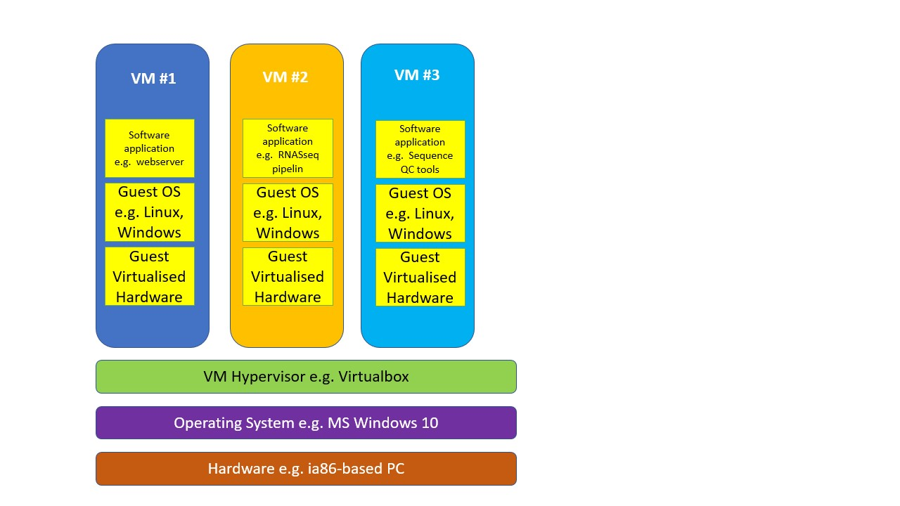
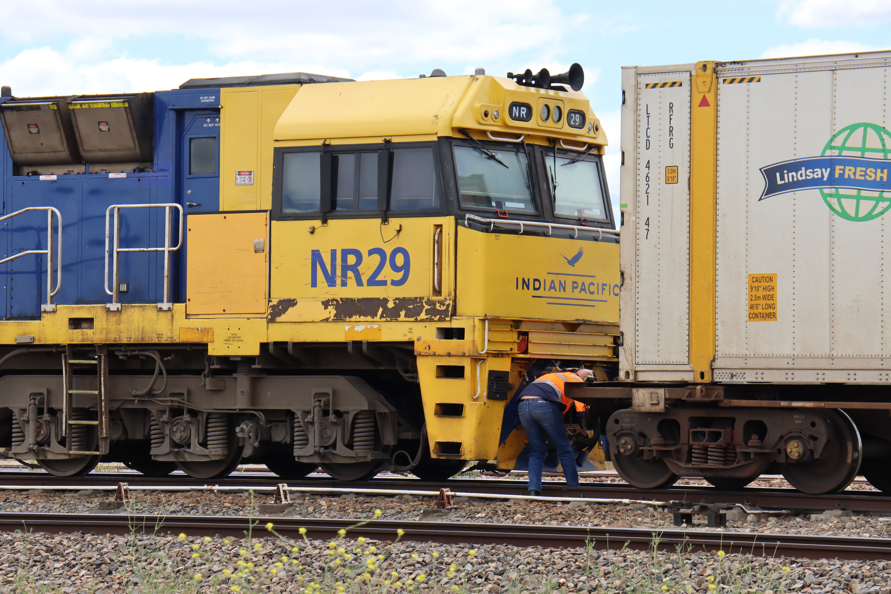
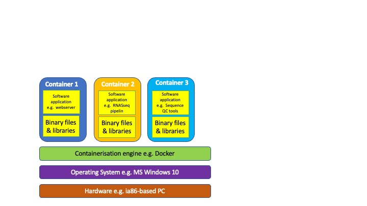

<center>
{: style="width:2.7559055118110236in;height:1.8371686351706036in"}
</center>
[Rocky Road Brownies](https://commons.wikimedia.org/w/index.php?curid=48410887) by Chocolate-Dessert-Recipes.com, [CC BY 2.0](https://creativecommons.org/licenses/by/2.0/deed.en)

**Teaching Outcomes**

By the end of this lesson, you will be able to

* List the issues relating to running software on users machines
* Students can name the benefits and drawbacks of native installations, virtual machines (VMs) and containers

**Teaching Experience(s)** This course will delivered by a mixture of the following:    

> * Lectures
> * short quizzes
> * Open class discussions

## Enabling use of your software by other researchers

So far we have learnt how to program, how to document our code, how to test it and how to publish it to a repository (Findable & Accessible under the [FAIR principles](https://force11.org/info/the-fair-data-principles/)) - what more do we have to do?

## "Well it works on my machine..." How often do we hear that?

***Why is it so difficult to run other peoples' code?***

This is a fair question - over your career there will be many times you will come across software that is potentially useful to you, that you download & install and find that it doesn't work (maybe with a cryptic error message for you to search for online).

**Potential barriers**

* Their computer has different hardware or operating system to yours. Executable code is often created to run on a specific microprocessor hardware. MS-Windows programs run on ia-x86 processors (and possibly ARM ones) whilst MacOS has run on 68K, PowerPC, Ia86 and ARM (M1&M2). The main target Operating systems are Windows, MacOS & Linux - all of which have different interactions with hardware and applications. In theory this can be catered for by developing versions for the different hardware and OS platforms nut this can be expensive in time, equipment, and support resources.
* Different Software versions
* Users' Technical ability -- It's wrong to assume high IT experience or to expect them to attain it just to use your software (Raising the 'cost of entry' and dissuading them from using it).

<center>___A Summary of the Pros & Cons of providing detailed DIY instructions___</center>   

|  Pros    |  Cons |
|---|---|
| Closest to the software authors' development environment  | Not always easy to capture exact pre-requisites     |
|   | Can require significant IT experience or support if issues are encountered    |
|   | Could override/replace version of existing software on users PC          |

**Challenge**:

> In teams analyse the example R or Python programs with respect to potential barriers to usage by others. We will then have a class discussion of the potential issues you have identified

***So, what can we do about this?***

* Extensive documentation on installing all the pre-requisites to run our software including specific version numbers. Note versions are prone to change and so we would have to keep this 'recipe' up to date to ensure continued success.
* Include Virtual environments in the instructions
* Create a Virtual Machine (VM)
* Create a software Container e.g. a Docker container.

## What is a virtual environment?

A virtual environment is a tool that lets you create an isolated tailored environment for a particular application. It enables you to have different versions of the same tools/packages or languages on the same machine by partitioning the environment. Basically when you switch to (activate) an environment then you only have access to the tools that you installed in that environment.    

With Python we have an embarrassment of riches when it comes to virtual environment tools. It comes with the __venv__ tool but many others are available ([conda](https://docs.conda.io/en/latest/), [virtualenv](https://virtualenv.pypa.io/en/latest/) and [poetry](https://python-poetry.org) to name but a few). Each comes with its own advantages, disadvantages  and features.   

!!! info "Which one do I use?"
    That is a very good question and the answer is "It depends..."   
    Reasons to use venv:  
    - On Python 3.3 or later versions   
    - Don't want install any more software (venv is usually 'baked' into a python installation   
    whereas virtualenv has to be installed (e.g. 'pip install --user virtualenv' ) i.e. likely   
    to be on an application end-users python installation.   
    - Wanting only a simple, lightweight and easy-to-use tool  
    - Need the pip built-in support    
    Reasons to use virtualenv:
   
    - You are stuck on an older version of Python (pre-3.3)   
    - Require virtual environements using specific versions of the Python interpreter   
    - Need more control over the virtual environment setup than supplied by venv      
    
_How do we use a virtual environment? (An example using venv)_   

1. Create the virtual environment   
    ```python -m venv <directory>```    
   This creates the VE directory (if it doesn't exist already) along with symbolic links to the default version of
   the python interpreter (can be over-ridden to use other versions) along with directories to store the VE-specific
   installed packages and scripts to activate & deactivate the environment.    

2. Move into the environments directory and activate it   
   ```cd <directory>```   
   ```source bin/activate```    
    __Notice how the command prompt now starts with the environment name.__       
    
3. Install whatever packages you need using the pip Python package manager (e.g. with 'pip install -r requirements.txt').    
   ``` python -m pip install <package>``` _or_    
   ```python -m pip install <package>==<version>``` _To install a particular version of a package_
   
4. Copy in/Download your source code and any required data    
   ```cp <source location>/<application.py> <application.py>```     
   
5. Run the application    
   ```python <application.py>```    
   
6. Deactivate the environment to return you to your default Python environment and packages e.g. to run your 'normal' software.
    ```deactivate```   
   __Notice how the command prompt has reverted to it's previous form__       

!!! info "Those commands don't work on my nachine!"
    Weren't we supposed to be getting away from that sort of thing?   
    Unfortunately, depending upon your Operating System and how it is setup/python is   
    installed you many have to use 'python3' or 'pip3' in place of python or pip.     
    You shoul make sure that your installed python is version 3.x as version 2 is no   
    longer supported (Type 'python --version' to find out wehat you have).   

#### Operating System variations (Mainly Windows)   
| Command  | Linux  | Windows  | MacOS  |
|---|---|---|---|
| Create VE  | python -m venv <directory>  | python -m venv <directory> | python -m venv <directory>  |
| Activate VE  | source bin/activate  | Scripts\activate.bat or Scripts\Activate.ps1 (Powershell) | source bin/activate  |
| Deactvate VE  |  deactivate  | deactivate   | deactivate   |

One complication is that you have to emember to 'activate' the specific environment for the selected application to have the correct supporting software infrastructure. That said there are (several) additional tools that activate the virtual environment when you move (cd) into the programs subdirectory an example of this sort of tool is [direnv](https://direnv.net).  
The downside to this is that you need to choose the tool appropriate/best suited for your application and provide instructions for theend-user to install it (who may have other similar & potentially incompatible tools installed,).   

!!! example "Virtual environment exercise"
    * Use pip to install version 2.2.26 of [django web framework package](https://pypi.org/project/Django/)
    * Create a directory with a virtual environment using 'venv'
    * in the environment, install version 4.0.3 of django
    * Turn the VE on and off and demonstrate that two different django environments are available.    
    ??? success "Solution (linux)"
        ```python -m pip install django==2.2.26```   
        ```python -m pip list```    
        ```python -m venv env_exercise```    
        ```cd env_exercise```  
        ```source bin/activate```
        ```python -m pip install django==4.0.3```   
        ```python -m pip list```    
        ```deactivate```    
        ```python -m pip list```        

<center>___A Summary of the Pros & Cons of using virtual environments___</center>  

| Pros  | Cons  |
|---|---|
| Lots of options to choose from | Lots of options to choose from |
| Application environment does not affect users other programs | Need to know how to use |
| useful when developing (can create requirements.txt e.g. python -m pip freeze > requirements.txt)   | Must remember to activate/deactivate    |
| -    | Extra resource usage memory & diskspace for python version & packages |
| -    | use of more sopisticated environments e.g. virtualenv need installation  |


## What is a virtual machine?

Stated simply a virtual machine (VM) is software that emulates the hardware and software of a computer and runs this emulation on your (host) computer. A layer, called the hypervisor, has the role of running the VM and transferring data in and out of it.
<center>
{: style="width:6.2in;height:6.2in"}. 
</center>

* Examples of software to host VMs: [Microsoft Hyper-V](https://learn.microsoft.com/en-us/virtualization/hyper-v-on-windows/about/), [Virtualbox (Mac OS, Windows & Linux)](https://www.virtualbox.org) [UTM (recommended for Apple Silicon e.g. M2 Macs)](https://github.com/utmapp/UTM).  

<center>___A Summary of the Pros & Cons of using Virtual Machines___</center>  

| Pros  | Cons  |
|---|---|
| Does not affect Host OS | Can require a similar level of IT knowledge/expertise to create the software environment for VM |
| Can run several servers on one machine | Each VM simulates the client OS as well as the hardware so they can get large and heavily consume disk & memory resources and can be slow to start up |
| Simulates hardware resources that may not be present on host hardware |  |

## What is a container?

Let's consider the analogy of shipping containers that are used throughout the world.

{: style="width:4.46in;height:5.6in"}. 

Photo by [Nur Alamin](https://unsplash.com/@nuralamin12?utm_source=unsplash&utm_medium=referral&utm_content=creditCopyText) on [Unsplash](https://unsplash.com/photos/xifUN_Mkf8Y?utm_source=unsplash&utm_medium=referral&utm_content=creditCopyText)

{: style="width:5.6in;height:3.6in"}. 

Photo by [Ian Taylor](https://unsplash.com/@carrier_lost?utm_source=unsplash&utm_medium=referral&utm_content=creditCopyText) on [Unsplash](https://unsplash.com/photos/jOqJbvo1P9g?utm_source=unsplash&utm_medium=referral&utm_content=creditCopyText)

{: style="width:5.5in;height:3.6in"}. 

Photo by [Michael SKOPAL](https://unsplash.com/@michael_skopal?utm_source=unsplash&utm_medium=referral&utm_content=creditCopyText) on [Unsplash](https://unsplash.com/photos/z5tiShyxZnc?utm_source=unsplash&utm_medium=referral&utm_content=creditCopyText)

{: style="width:4.2in;height:6.32in"}. 

Photo by [Nathan Cima](https://unsplash.com/@nathan_cima?utm_source=unsplash&utm_medium=referral&utm_content=creditCopyText) on [Unsplash](https://unsplash.com/photos/MHXJ9p64Jw8?utm_source=unsplash&utm_medium=referral&utm_content=creditCopyText)

**Real-world containers are:**

* Standardised size/shape/Dimensions
* Stackable design
* Carried by a variety of means of transportation
* Standardised machinery to load & unload containers

A software container is defined by a manifest or recipe file that lists all of the software and files to be installed within it but makes use of functions from the Host OS,

* Can be executed on Windows, MacOS & Linux
* Standardised recipe for building and loading/running a container for all supported platforms
* Multiple containers can be run on a host operating system
<center>
{: style="width:9.2in;height:5.3in"}. 
</center>
<center>___A Summary of the Pros & Cons of using Software Containers___</center>  

| Pros  | Cons  |
|---|---|
| Does not affect software installations on host computer i.e. install into *tabula rasa* environment. | Requires expertise training in creating the Dockerfiles |
| Lightweight - consumes less resources on host computer and faster to launch than VMs | Should do tests to compare results with native install |
| Uses Dockerfiles to script construction of compute environment |   |
| Supported/welcomed by most Cloud computing providers. Many click & launch options (including [Gitpod](https://www.gitpod.io)) are available. |   |

We will cover creating a Dockerfile later in this course.

!!! example "Introduction comprehension exercise 1"
    Your computer runs python 3.1 and you do not want to upgrade it. You need virtual environments for a    
    project and wish to use version 3.0 for your project. You should install virtualenv - TRUE or FALSE?
    ??? success "answer"
        TRUE    
    

!!! example "Introduction comprehension exercise 2"
     Your software project will access a CD/DVD-ROM drive image containing data but you cannot guarantee    
     that the end-user has this hardware on their computer. This cannot be solved by deploying a virtual   
     machine - TRUE or FALSE?
    ??? success "answer"
        FALSE A VM can emulate hardware e.g. a CD-ROM drive as well as software


    
