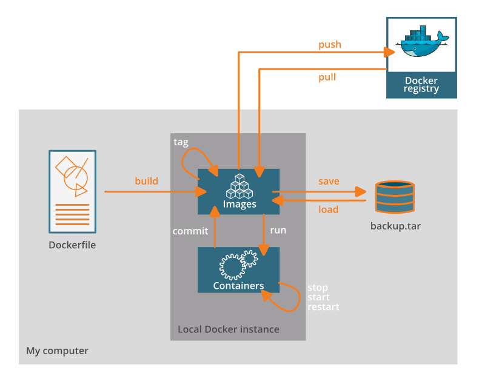

## Learning outcomes

**After having completed this chapter you will be able to:**

- fetch and run Docker containers on their computer.
- interpret the instructions of a Dockerfile
- create simple Docker containers to run simple python/R scripts.

## Material

TODO: add overview of necessary files, video, etc

[:fontawesome-solid-file-pdf: Show the presentation](https://liascript.github.io/?https://raw.githubusercontent.com/vibbits/material-liascript/master/slides-docker-introduction.md){: .md-button }

* Unix command line [E-utilities documentation](https://www.ncbi.nlm.nih.gov/books/NBK179288/)


## 2.1 Docker Dance

We will use Docker as an example to illustrate the development and use of containers.

### Install Docker

Please follow the installation of the latest version of Docker Desktop for your operating system. It is described at [Get Docker](https://docs.docker.com/get-docker/)

!!! Info
    Commercial use of Docker Desktop in larger enterprises (more than 250 employees OR more than $10 million USD in annual revenue) requires a paid subscription.
    Note that 'commercial use' is interpreted quite broad. 

### Introducing the Dockerfile

The Dockerfile is the starting point of the Docker Dance which is schematically drawn here.

{: style="width:650px;"}

Now, let's focus on the instructions for building Docker container images which are saved in a text file, named by default **Dockerfile**.

This is a basic recipe with three statements, one FROM and two RUN statements. 

To follow along on your own, copy the content of the shown `Dockerfile` into a file named `Dockerfile` and save the file on your disk.

```sh title="Dockerfile"
FROM ubuntu:18.04

RUN apt update && apt -y upgrade
RUN apt install -y wget
```

The **FROM** statement describes the parent image. Typically, an 'operating' system but you can also use an image of other parties as a starting point. This instruction creates the base layer.

```sh
FROM ubuntu:18.04
```

!!! info "Recommendation" 
    Pin the version of the OS of the base layer.
    There is an [interesting publication](https://doi.org/10.1371/journal.pcbi.1008316) regarding recommendation when manually crafting Dockerfiles. Rule 5 points out the importance of pinning versions of the base image but also system libraries or other installed software. 

The **RUN** statement specifies the command to execute inside the image filesystem.

Think about it this way: every RUN line is essentially what you would run to install programs on a freshly installed Ubuntu OS. This command will be executed as root in the container.

```sh
RUN apt install wget
```

Each row in the recipe corresponds to a **layer** of the final image.

TODO: create illustration like e.g. https://docs.docker.com/build/guide/images/layers.png
			
### Anatomy of the commands

With this basic Dockerfile, we will already start the build process which creates an image. For reference, have a look at the sketch of the Docker Dance above.

**Building Docker image**
		 								
The build command implicitly looks for a file named `Dockerfile` in the current directory:

```sh
docker build .

# or by specifying the exact file name

docker build --file Dockerfile .
```

**Syntax**: -file / -f

. stands for the context (in this case, current directory) of the build process. This makes sense if during the build process, we will copy files from local filesystem, for instance. 

!!! info
    Avoid contexts (directories) overpopulated with files (even if not actually used in the recipe).

You can define a specific name for the image during the build process.

**Syntax**: -t imagename:tag. If not defined :tag default is latest.

!!! example "Exercise"
    ```sh
    docker build -t mytestimage:v1 .
    ```

The following output should be shown:

```sh
account@your-computer folder % docker build -f Dockerfile .
[+] Building 11.3s (7/7) FINISHED                                                                                                                                                                                               docker:desktop-linux
 => [internal] load build definition from Dockerfile                                                                                                                                                                                            0.0s
 => => transferring dockerfile: 113B                                                                                                                                                                                                            0.0s
 => [internal] load .dockerignore                                                                                                                                                                                                               0.0s
 => => transferring context: 2B                                                                                                                                                                                                                 0.0s
 => [internal] load metadata for docker.io/library/ubuntu:18.04                                                                                                                                                                                 1.6s
 => [1/3] FROM docker.io/library/ubuntu:18.04@sha256:152dc042452c496007f07ca9127571cb9c29697f42acbfad72324b2bb2e43c98                                                                                                                           3.4s
 => => resolve docker.io/library/ubuntu:18.04@sha256:152dc042452c496007f07ca9127571cb9c29697f42acbfad72324b2bb2e43c98                                                                                                                           0.0s
 => => sha256:064a9bb4736de1b2446f528e4eb37335378392cf9b95043d3e9970e253861702 22.71MB / 22.71MB                                                                                                                                                2.6s
 => => sha256:152dc042452c496007f07ca9127571cb9c29697f42acbfad72324b2bb2e43c98 1.33kB / 1.33kB                                                                                                                                                  0.0s
 => => sha256:f97a5103cca28097326814718e711c9c41b54853c26959d73495e40b1dd608f2 424B / 424B                                                                                                                                                      0.0s
 => => sha256:d1a528908992e9b5bcff8329a22de1749007d0eeeccb93ab85dd5a822b8d46a0 2.31kB / 2.31kB                                                                                                                                                  0.0s
 => => extracting sha256:064a9bb4736de1b2446f528e4eb37335378392cf9b95043d3e9970e253861702                                                                                                                                                       0.7s
 => [2/3] RUN apt update && apt -y upgrade                                                                                                                                                                                                      3.9s
 => [3/3] RUN apt install -y wget                                                                                                                                                                                                               2.3s
 => exporting to image                                                                                                                                                                                                                          0.1s
 => => exporting layers                                                                                                                                                                                                                         0.1s
 => => writing image sha256:48bdb8036e8c97d6fde1e515291345425b78b3c33830768caad12ad98ea17b2c                                                                                                                                                    0.0s
```

Once the build process is finished, the output should be `Building ... FINISHED`. Then you are good to go.

As next step, we will check with the command `docker images` that you see the newly built image in the list of images.

!!! example "Exercise"    
    ```sh
    docker images
    ```

    ??? success "Solution"       
	
        ```sh
        account@your-computer folder % docker images 
        REPOSITORY                 TAG       IMAGE ID       CREATED         SIZE 
        mytestimage                v1        48bdb8036e8c   7 minutes ago   96.9MB 
        ``` 
        Let’s check the ID of the image to run it later.

But right now, we investigate some additional statements for the recipes!

Additional statements for the Dockerfile	

| command | what does it do?                 | Example                                               |
|---------|----------------------------------|-------------------------------------------------------|
| LABEL   | Who is maintaining the container image | LABEL  maintainer=”your name <your.email@domain.org>” |
| WORKDIR        | all subsequent actions will be executed in that working directory. | WORKDIR ~ |
| COPY    | lets you copy a local file or directory from your host (the machine from which you are building the image) | COPY ~/.bashrc . # COPY source destination  |
| ADD     | same, but ADD works also for URLs, and for .tar archives that will be automatically extracted upon being copied. |  |
| ARG     | available only while the image is built  | |
| ENV     | available for the future running containers | |
| ENTRYPOINT  | The ENTRYPOINT specifies a command that will always be executed when the container starts.  | |
| CMD     | The CMD specifies arguments that will be fed to the ENTRYPOINT. | |

**Further readings**

Difference between ADD and COPY explained [here](https://stackoverflow.com/questions/24958140/what-is-the-difference-between-the-copy-and-add-commands-in-a-dockerfile) and [here](https://nickjanetakis.com/blog/docker-tip-2-the-difference-between-copy-and-add-in-a-dockerile).

Difference between ARG and ENV explained [here](https://vsupalov.com/docker-arg-vs-env/).

### A longer recipe

Below is a longer recipe (save it in a text file named `Dockerfile-ex2`):

```sh title="Dockerfile-ex2"
FROM ubuntu:18.04

LABEL version="1.0"
LABEL description="This is an example image\
that should download a picture once run."

WORKDIR /scratch 

RUN apt-get update && apt-get -y upgrade
RUN apt-get install -y wget

ENTRYPOINT ["/usr/bin/wget"]
CMD ["https://cdn.wp.nginx.com/wp-content/uploads/2016/07/docker-swarm-hero2.png"]
```

!!! example "Exercise"
    Let's also build a Docker image based on the `Dockerfile-ex2`. What is the syntax?
    
    ??? success "Solution"
         
        ```sh
        account@your-computer folder % docker build -t download-image:v1 -f Dockerfile-ex2 .
        ...
        account@your-computer folder % docker images
        REPOSITORY                 TAG       IMAGE ID       CREATED         SIZE
        download-image             v1        42f09c5ca259   34 seconds ago   96.9MB
        ```

**Tips for Docker files**
						
You should try to separate the Dockerfile into as many stages as possible, because this will allow for better caching.

For example for `apt-get`:

You must run apt-get update and apt-get install in the same command, otherwise you will encounter caching issues.
Remember to use apt-get install -y, because you will have no control over the process while it’s building.

### Running our Docker container

Now we want to use what is inside the image.

`docker run` creates a fresh container (active instance of the image) from a Docker (static) image, and runs it.

The format is:

```sh
docker run [docker options] <IMAGE NAME> [image arguments]
```

This means that arguments that affect the way Docker runs must always go before the image name, but arguments that are passed to the image itself must go after the image name.

!!! example "Exercise"
    You can execute any program/command that is stored inside the image.
    What happens if you execute `ls` in your current working directory: is the result the same?
    ```sh
    docker run mytestimage:v1 /bin/ls
    ```

    ??? done "Answer"
        
        No, it is not. The listing of the working directory within the container will be displayed. In our case, this is `/`. 	

!!! example "Exercise"
    You can execute any program/command that is stored inside the image.

    ```sh
    docker run mytestimage:v1 /bin/whoami
    docker run mytestimage:v1 cat /etc/issue
    ```
    ??? done "Answer"
        Anything surprising happened and why?
        The first command did not produce a valid output. Which command do you have to run to get a valid response? And what is the user? 	

**List running containers**

Let's run another command in the shell.

```sh
docker ps
```

In this case, we would like list all running containers but we will get back an empty result.

```sh
account@your-computer ~ % docker ps
CONTAINER ID   IMAGE     COMMAND   CREATED   STATUS    PORTS     NAMES
```

This is normal since before each of the executed containers only ran a very short time. All commands were executed in milliseconds.  

Now, let's list all containers whether they are running or not:

```sh
docker ps -a
```

Now, the result is more insightful.

```sh
albot@Alexanders-MacBook-Pro ~ % docker ps -a
CONTAINER ID   IMAGE               COMMAND                  CREATED          STATUS                      PORTS     NAMES
6cdfeb6b412f   mytestimage:v1      "whoami"                 8 minutes ago    Exited (0) 5 minutes ago              determined_torvalds
e7a143e1b594   mytestimage:v1      "cat /etc/issue"         9 minutes ago    Exited (0) 5 minutes ago              elated_lalande
7fed0970b698   mytestimage:v1      "/bin/whoami"            10 minutes ago   Created                               frosty_noether
```

The IDs that are shown can be useful for other docker commands like `docker stop` and `docker exec` in case the containers will run longer. The containers with the IDs `6cdfeb6b412f` and `e7a143e1b594` have been run succesfully and now have the status `Excited`. The last one has only been created since we received an error message. We will not go into more details now. In a chapter later on, we will shortly touch on the containers which run e.g. web applications.

But before we go on to second image we have created before, let's run an container interactively.

```sh
docker run -it mytestimage:v1
```  

!!! example "Exercise"
    Verify what the operating system of the container is? One option is `cat /etc/os-release`. 

    ??? done "Answer"
        
        ```sh
        root@5a7f73d47ff5:/# cat /etc/os-release
        NAME="Ubuntu"
        VERSION="18.04.6 LTS (Bionic Beaver)"
        ID=ubuntu
        ID_LIKE=debian
        PRETTY_NAME="Ubuntu 18.04.6 LTS"
        VERSION_ID="18.04"
        HOME_URL="https://www.ubuntu.com/"
        SUPPORT_URL="https://help.ubuntu.com/"
        BUG_REPORT_URL="https://bugs.launchpad.net/ubuntu/"
        PRIVACY_POLICY_URL="https://www.ubuntu.com/legal/terms-and-policies/privacy-policy"
        VERSION_CODENAME=bionic
        UBUNTU_CODENAME=bionic
        ```

!!! example "Exercise"
    Run the command `whoami`, now in the container.

    ??? done "Answer"
        You might have seen before that you are indeed `root`. This also means that you can install other programms in this interactive shell. 

Before we exit the shell in the container, we will have a quick look at the status of the container like we did above.

!!! example "Exercise"
    Please open another terminal and type `docker ps -a`. 

    ??? done "Answer"

        You will see that the current container `5a7f73d47ff5` has the status `Up`. So, it is indeed still running since we have started an interactive shell. 
        ```sh
        CONTAINER ID   IMAGE               COMMAND                  CREATED             STATUS                         PORTS     NAMES
        5a7f73d47ff5   mytestimage:v1      "/bin/bash"              11 minutes ago      Up 11 minutes                            vigorous_taussig
        6cdfeb6b412f   mytestimage:v1      "whoami"                 57 minutes ago      Exited (0) 57 minutes ago                determined_torvalds
        e7a143e1b594   mytestimage:v1      "cat /etc/issue"         58 minutes ago      Exited (0) 58 minutes ago                elated_lalande
        7fed0970b698   mytestimage:v1      "/bin/whoami"            58 minutes ago      Created                                  frosty_noether
        ```

Exit the interactive container by typing `exit` so that we return to the shell of our host. Let's come back to our second image we have created before.

First identify the id of this image by running `docker images`. When preparing the course, the ID was `42f09c5ca259`.

!!! example "Exercise"
    Run this container without any specific command. You might recall that a default command is defined in the recipe.

    ??? done "Answer"

        ```sh
        account@your-computer folder % docker run 42f09c5ca259
        --2023-12-30 13:59:48--  https://cdn.wp.nginx.com/wp-content/uploads/2016/07/docker-swarm-hero2.png
        Resolving cdn.wp.nginx.com (cdn.wp.nginx.com)... 104.18.10.5, 104.18.11.5
        Connecting to cdn.wp.nginx.com (cdn.wp.nginx.com)|104.18.10.5|:443... connected.
        HTTP request sent, awaiting response... 200 OK
        Length: 446827 (436K) [image/png]
        Saving to: 'docker-swarm-hero2.png'

          0K .......... .......... .......... .......... .......... 11% 13.0M 0s
         50K .......... .......... .......... .......... .......... 22% 12.1M 0s
        100K .......... .......... .......... .......... .......... 34% 5.30M 0s
        150K .......... .......... .......... .......... .......... 45% 6.02M 0s
        200K .......... .......... .......... .......... .......... 57% 10.4M 0s
        250K .......... .......... .......... .......... .......... 68% 9.34M 0s
        300K .......... .......... .......... .......... .......... 80% 11.0M 0s
        350K .......... .......... .......... .......... .......... 91% 2.73M 0s
        400K .......... .......... .......... ......               100%  250M=0.06s
         
        2023-12-30 13:59:48 (7.41 MB/s) - 'docker-swarm-hero2.png' saved [446827/446827]
        ```

        As you see, the png file is downloaded but do you find it on the host? Probably no since the container is isolated from the host.

### Volumes

Docker containers are fully isolated. It is necessary to mount volumes in order to handle input/output files.
By default, Docker containers cannot access data on the host system. This means you cannot use host data in your containers. All data stored in the container will be lost when the container exits.

You can solve this like this:

-v /path/in/host:/path/in/container: This bind mounts a host file or directory into the container. Writes to one will affect the other. Note that both paths have to be absolute paths, so you often want to use`pwd`/some/path

!!! example "Exercise"
    For this exercise, we will bind-mount the current directory of our user on the host machine to the `WORKDIR` as defined in the Dockerfile-ex2.
    `docker run --volume $(pwd):/scratch download-image:v1`

    ??? done "Answer"

        ```sh
        --2023-12-30 16:55:20--  https://cdn.wp.nginx.com/wp-content/uploads/2016/07/docker-swarm-hero2.png
        Resolving cdn.wp.nginx.com (cdn.wp.nginx.com)... 104.18.10.5, 104.18.11.5
        Connecting to cdn.wp.nginx.com (cdn.wp.nginx.com)|104.18.10.5|:443... connected.
        HTTP request sent, awaiting response... 200 OK
        Length: 446827 (436K) [image/png]
        Saving to: 'docker-swarm-hero2.png'

          0K .......... .......... .......... .......... .......... 11% 13.0M 0s
         50K .......... .......... .......... .......... .......... 22% 12.1M 0s
        100K .......... .......... .......... .......... .......... 34% 5.30M 0s
        150K .......... .......... .......... .......... .......... 45% 6.02M 0s
        200K .......... .......... .......... .......... .......... 57% 10.4M 0s
        250K .......... .......... .......... .......... .......... 68% 9.34M 0s
        300K .......... .......... .......... .......... .......... 80% 11.0M 0s
        350K .......... .......... .......... .......... .......... 91% 2.73M 0s
        400K .......... .......... .......... ......               100%  250M=0.06s

        2023-12-30 16:55:21 (7.41 MB/s) - 'docker-swarm-hero2.png' saved [446827/446827]
        ```

        As you see, the png file is downloaded and do you find it on the host in the current working directory? 
        If all went fine, you should see the file `docker-swarm-hero2.png` in your current directory.

## 2.2 Container registries (e.g. Docker Hub)

Images can be stored locally or shared in a registry. Docker hub is the main public registry for Docker images.
Let’s search the keyword “ubuntu”

TODO: insert screenshot of the output

There are a lot of alternatives to Docker hub for image registries depending on the needs of the organisation or company. Some examples are shown below:

TODO: insert image of the registries

1. Get the latest image or latest release

```sh
docker pull ubuntu
```

In this case, the Ubuntu image with the tag `latest` is downloaded.

```sh
albot@Alexanders-MacBook-Pro toto % docker pull ubuntu
Using default tag: latest
latest: Pulling from library/ubuntu
005e2837585d: Pull complete
Digest: sha256:6042500cf4b44023ea1894effe7890666b0c5c7871ed83a97c36c76ae560bb9b
Status: Downloaded newer image for ubuntu:latest
docker.io/library/ubuntu:latest
```

2. Check the versions of Ubuntu present and fetch version 18.04 using tags

TODO: add screenshot

```sh
docker pull ubuntu:18.04
```

When you ran this command, Docker first looked for the image on your local machine, and when it couldn’t find it, pulled it down from a cloud registry of Docker images called Docker Hub.
		 			
What other repositories are possible?
Have a look at the web site https://biocontainers.pro/ which is a specific directory of Bioinformatics related tools.
the images are stored in Docker hub and/or Quay.io (RedHat registry)
these images are normally created from [Bioconda](https://bioconda.github.io)

Example: FastQC
https://biocontainers.pro/#/tools/fastqc

TODO: Open solution
```sh
docker pull biocontainers/fastqc:v0.11.9_cv7
```

Where are these images stored? On Linux, they usually go to /var/lib/.
Docker is very greedy in storage, so regular cleaning is necessary. We will see later on how you can do the purging.
Sometimes, it is also useful to get more information about the images. You can do this via

```sh
docker image inspect
```

And lastly to complete the Docker Dance, we shortly show how to upload own containers to the DockerHub registry.

Note: You will have to use a public repository on DockerHub.

First, you will have to create an account on DockerHub. 

Usually, as first step before the upload of the image to the registry, you will use `docker login`. In this case, the command assumes that you'd like to login to DockerHub. 

As you have seen before, we have created two images based on simple recipes. Imagine that you'd like to share them publically. You will use the command `docker push`.
But before you need to rename the docker image so that the `push` command knows where the destination is.


```sh
docker tag download-image:v1 yourhubusername/download-image:v1
docker push yourhubusername/download-image:v1
```

**Useful resources**

[Dockerfile reference](https://docs.docker.com/engine/reference/builder/)
[Best practices for manual creation](https://journals.plos.org/ploscompbiol/article?id=10.1371/journal.pcbi.1008316)
[Ten simple rules for writing Dockerfiles for reproducible data science](https://journals.plos.org/ploscompbiol/article?id=10.1371/journal.pcbi.1008316)

