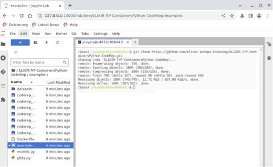

## Learning outcomes

**After having completed this chapter you will be able to:**

- run the Python script using a Docker container on your computer.
- run the Python script using a Juptyer Notebook container on your computer.

## Material

TODO: add overview of necessary files, video, etc

[:fontawesome-solid-file-pdf: Download the presentation](../assets/pdf/docker_dance.pdf){: .md-button }

* Unix command line [E-utilities documentation](https://www.ncbi.nlm.nih.gov/books/NBK179288/)
 
## 4.1 Running the script within a Jupyter Notebook 

We will use Docker to start a JupyterNotebook within the JupyterLabs environment.

Working with JupyterLabs as a Docker extension begins with opening the Docker Desktop. 

Here are the steps to follow:

- Choose Extensions in the left sidebar.
- Switch to the Browse tab.
- In the Categories drop-down, select Utility Tools.
- Find Jupyter Notebook and then select Install.

Wait a bit before the JupyterLabs extension is installed. You can start the extension by the JupyterNotebook icon on the left side of the Docker Desktop menu.

Open a Terminal by clicking the Terminal icon under the Other category. Clone the directory by using `git clone`.
```
git clone https://github.com/elixir-europe-training/ELIXIR-TrP-ContainersPython-CodeRep.git
```

Open the Jupyter notebook in the `examples` directory of the said repository. You should be able to execute the Python code using the notebook.

In case, you like to extract the output from the notebook, you could run the following docker command. Obviously, you could also download the content via the interface.

```sh
docker run --rm --volumes-from jupyter_embedded_dd_vm -v $(pwd):/backup ubuntu tar cvf /backup/backup.tar /home/jovyan/work
```

## 4.2 Running the Python script on the command line 

In order to run the script using a Docker container, we will use the same Docker image which is used for running the JupyterLab in the example above.

!!! Exercise

```sh
docker images
docker image inspect jupyter/scipy-notebook:lab-4.0.6 | grep Working
```

Furthermore, please clone the above repo again on your local computer. Switch to the examples directory.

In order to run the script, we need to bind mount the local directory where the script and two python files are. Furthermore, we need to specify a working directory upon running the container (and we also need to specify a user and group ID for Linux hosts).

```sh
cd examples/
docker run --rm -v $(pwd):/home/jovyan/work/ -w /home/jovyan jupyter/scipy-notebook:lab-4.0.6 python codereppy_min_batch.py
```
------
Mark

```sh
docker run -it --rm -p 10000:8888 -v "${PWD}":/home/jovyan/work quay.io/jupyter/datascience-notebook:2024-01-15

 http://127.0.0.1:8888/lab?token=b71632b47d40d57e1173d211d1972c261b70b3bc4d503f50
[I 2024-02-05 16:14:51.455 ServerApp] Skipped non-installed server(s): bash-language-server, dockerfile-language-server-nodejs, javascript-typescript-langserver, jedi-language-server, julia-language-server, pyright, python-language-server, python-lsp-server, r-languageserver, sql-language-server, texlab, typescript-language-server, unified-language-server, vscode-css-languageserver-bin, vscode-html-languageserver-bin, vscode-json-languageserver-bin, yaml-language-server
c[I 2024-02-05 16:22:21.248 LabApp] 302 GET /lab?token=[secret] (@172.17.0.1) 1.28ms
[I 2024-02-05 16:24:56.112 ServerApp] User f99ecbe86c6f4e8aa45a21dd895ac41f logged in.
[I 2024-02-05 16:24:56.113 ServerApp] 302 POST /login?next=%2F (f99ecbe86c6f4e8aa45a21dd895ac41f@172.17.0.1) 2.04ms
[I 2024-02-05 16:24:56.116 ServerApp] 302 GET / (@172.17.0.1) 0.29ms
0.00s - Debugger warning: It seems that frozen modules are being used, which may
0.00s - make the debugger miss breakpoints. Please pass -Xfrozen_modules=off
0.00s - to python to disable frozen modules.
```

open browser to url displayed in terminal 7 using token to login (displayed after token=)     

(base) jovyan@c481ec0bb643:~$ git clone https://github.com/elixir-europe-training/ELIXIR-TrP-ContainersPython-CodeRep.git
Cloning into 'ELIXIR-TrP-ContainersPython-CodeRep'...
remote: Enumerating objects: 745, done.
remote: Counting objects: 100% (202/202), done.
remote: Compressing objects: 100% (135/135), done.
remote: Total 745 (delta 137), reused 80 (delta 58), pack-reused 543
Receiving objects: 100% (745/745), 12.71 MiB | 837.00 KiB/s, done.
Resolving deltas: 100% (397/397), done.
(base) jovyan@c481ec0bb643:~$ 
{: style="width:650px;"}
